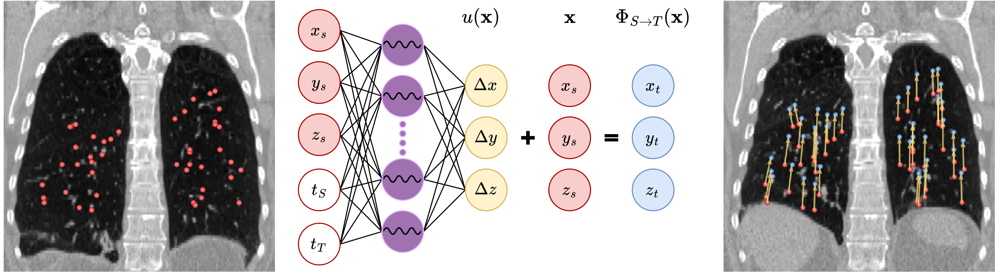
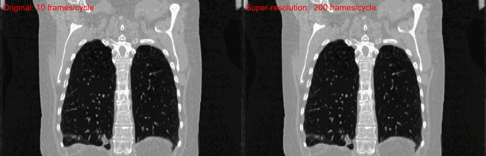

# Temporal INR
Code for our papers "Temporal Periodic Image Registration with Implicit Neural Representations" and "Temporal Super-Resolution of Medical Images with Implicit Neural Representations" from the MLMI workshop at MICCAI 2025.

We utilize implicit neural representations to perform registration over periodic image data, here the lung CT from the [DIRLAB dataset](https://med.emory.edu/departments/radiation-oncology/research-laboratories/deformable-image-registration/index.html) and an in-house-heart CT dataset.

The network it self is trained for image registration over a periodic image sequence, but can also be used for creation of new images in the sequence.

## Usage
To use the framework on the DIR-LAB dataset, the data must first be preprocessed by running

```
python utils/preprocess_dirlab.py --path path/to/dirlab 
```
which converts to .nii.gz files and calculates lung masks using the method of [Hofmanninger](https://github.com/JoHof/lungmask).

To run the registration framework
```
python registration.py --path path/to/dirlab --save_folder ./results
```

To do temporal super-resolution it requires the trained registration model, then it is run by
```
python interpolation.py --path path/to/dirlab --save_folder ./results --temporal_resolutions 50 200
```

Results of reconstruciton metrics can be replicated by running 
```
python reconstruction.py --path path/to/dirlab --save_folder ./results
```

## Figures
General network architecture and illustration of point registration.



Results of temporal super resolution on 4D lung CT.



## Citation
If you use this code, please cite our papers, depending on the usage

    @inproceedings{lowes2025TemporalINRReg,
        title={Temporal Periodic Image Registration with Implicit Neural Representations},
        author={Mathias Lowes and Kristine Aavild Sørensen and  Maxime Sermesant and Rasmus R. Paulsen},
        booktitle="Machine Learning in Medical Imaging",
        year="2025",
        publisher="Springer Nature Switzerland",
    }

    @inproceedings{lowes2025TemporalINRSuperRes,
        title={Temporal Super-Resolution of Medical Images with Implicit Neural Representations},
        author={Mathias Lowes and Kristine Aavild Sørensen and  Maxime Sermesant and Klaus Fuglsang Kofoed and Rasmus R. Paulsen},
        booktitle="Machine Learning in Medical Imaging",
        year="2025",
        publisher="Springer Nature Switzerland",
    }
